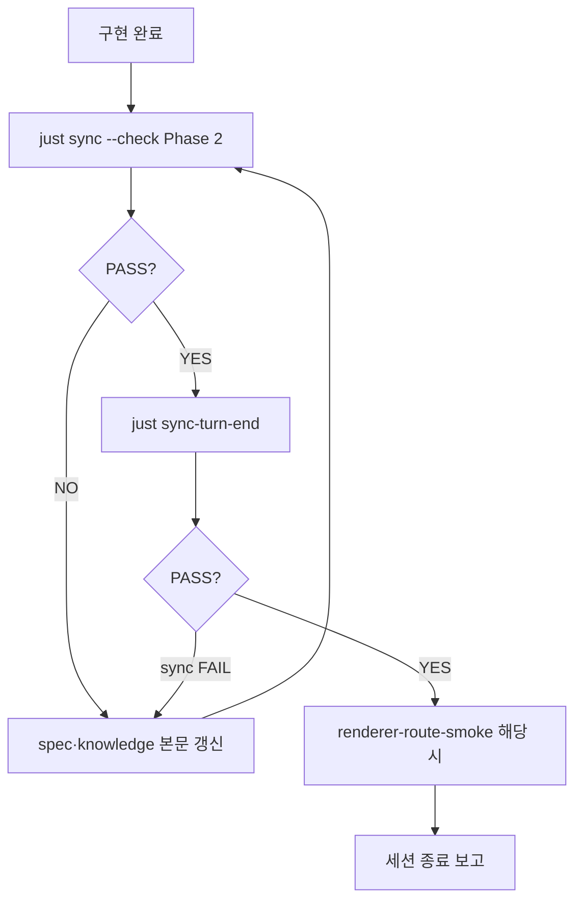

<!-- Language: ko -->

# Unified Sync (`/sync`)

**프로토콜 SSOT**: [.agents/skills/sync/SKILL.md](../skills/sync/SKILL.md)

`/sync`는 **한 워크플로**이고, `just sync`는 그 실행기입니다. 사용자가 기대하는 “코드·스펙 둘 다 지금 구현에 맞게 정합”은 아래 **Phase 2(문서 갱신) + Phase 3(기계 검증)** 조합입니다.

---

## 0. 무엇이 자동이고 무엇이 수동인가

| 단계 | 내용 | `just sync` 자동? |
|------|------|------------------|
| **Code sync** | `@code-sync-lock` 해시 일치 | ✅ `--check` |
| **Spec sync (본문)** | Claim·표·`Last Verified`를 코드에 맞게 **작성·수정** | ✅ 에이전트 자동 (Phase 2) |
| **Spec alignment** | git diff에 **문서 또는 후보 스펙** 갱신이 포함됐는지 검사 | ✅ `--check` |
| **Smoke** | 라우트 200 | ❌ `just renderer-route-smoke` (별도) |

> **정리**: `just sync --check`로 코드·스펙 정합성을 검증합니다. 스펙 본문 갱신은 **에이전트가 자동**으로 수행하며, `required` drift 시 에이전트가 스펙을 수정하고 다시 check합니다.

---

## 1. 실행 흐름



---

## 2. Phase별 절차

### Phase 1 — 코드 락 (선택·회귀 방지)

1. 회귀 방지가 필요한 블록에 `@code-sync-lock` / `@code-sync-unlock` 배치.
2. `just sync --lock <id> --file <path> [--spec docs/specs/...]`
3. 적법 수정 후 `just sync --update <id>`

### Phase 2 — Spec sync (본문 · 에이전트 자동)

**목표**: 디스크上的 코드가 SSOT, 스펙은 그에 맞는 Claim.

1. `just sync --check` 결과에서 drift를 확인한다.
2. `required` drift 시, 후보 스펙 경로를 읽고 `@code-sync-lock`의 `spec:` 필드가 가리키는 문서를 우선 갱신.
3. 휴리스틱 후보(예: consultation layout → `SPEC_consultation_grid_layout.md`)를 역검증.
4. `Last Verified`·저장 순서·hydrate 규칙 등 **표·절**을 코드와 일치시킨다.
5. 재발 패턴이면 `docs/knowledge/debug/RES_*.md`에 짧게 남긴다.
6. 갱신 후 다시 `just sync --check` → PASS 전까지 반복.
7. 이 과정은 수동 개입 없이 에이전트가 자동 수행됩니다.

### Phase 3 — 통합 검증 (`just sync --check`)

```bash
just sync --check
```

순서:

1. **Code lock** — 전역 `@code-sync-lock` 해시
2. **Spec alignment** — 이번 git diff에 `docs/specs/**`·`docs/knowledge/**` 등 문서 변경이 있거나, 후보 스펙 경로가 diff에 포함됐는지
3. `required` + 문서 없음 → **exit 1** (후보 스펙 목록 출력)

수동 역검증만 하고 문서 커밋이 다른 브랜치에 있는 경우(비권장):

```bash
just sync --check --ack-spec
```

CI 게이트:

```bash
just sync --check --strict
```

### Phase 4 — 런타임 (해당 시)

라우트·`next.config`·프록시·미들웨어를 건드렸으면:

```bash
just renderer-route-smoke   # :3000 dev 필요
```

---

## 3. 명령어 요약

| 명령 | 용도 |
|------|------|
| `just sync --check` | code lock + **spec alignment** (+ drift 힌트 출력) |
| `just sync-turn-end` | **/sync 종료 1줄** — `sync --check` → `lint-turn-end` (AskQuestion 금지) |
| `just sync --check --ack-spec` | 수동 역검증 완료 선언(사유는 PR/커밋에 기록) |
| `just sync --check --strict` | CI: required 시 문서 미갱신이면 exit 2 |
| `just sync --check --fix` | 후보 스펙 메타데이터 자동 보정(선택) |
| `just sync --lock` / `--update` | 락 생성·해시 갱신 |

---

## 4. 세션 종료 Definition of Done

**실행 순서 SSOT**: [sync/SKILL.md §2](../skills/sync/SKILL.md#2-세션-종료-실행-순서-ssot) — 아래는 요약.

> **AskQuestion 금지**: Phase 2 PASS 후 `just sync-turn-end`를 **즉시** 실행한다. `lint-turn-end` 단독 실행 여부를 묻지 않는다.

1. (선택) `just lint-fe` / `just lint-be` — 진행 중 자가진단
2. **Phase 2**: `just sync --check` → drift 시 spec 본문 갱신 → PASS까지 반복 (§2)
3. **종료 게이트**: `just sync-turn-end` (`sync --check` → `lint-turn-end` 1줄); sync 실패 시 Phase 2로 복귀
4. Route/프록시 변경 시 `just renderer-route-smoke`
5. Blueprint 종료 시 [reporting.md §1.0](../core/reporting.md) — `docs-ssot-headers` → `linear-sync` → `plan-close`
6. (권장) [`ROADMAP.md`](../../docs/plans/ROADMAP.md) 검토
7. 사용자 보고 시 **Unified Sync PASS** 한 줄 명시

CI: `just lint`가 `sync --check --strict` 포함 (`.github/workflows/ci.yml`).

---

## 관련 SSOT

- [Justfile](../../Justfile) — `sync`
- [scripts/agent/sync.py](../../scripts/agent/sync.py) — 구현 SSOT
- [docs/specs/technical/spec_integrated_sync_roadmap.md](../../docs/specs/technical/spec_integrated_sync_roadmap.md) — 로드맵
